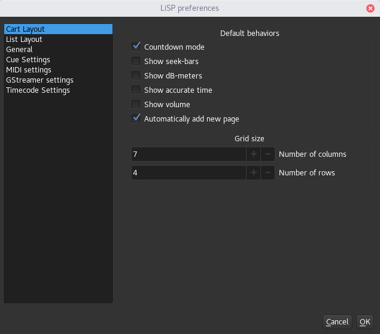

.. toctree::
    :hidden:

Cart Layout
===========

The Cart Layout organize all the cues in grid-like tabs, cues are shown as
buttons, as in the following image:

.. image:: media/cart_layout_main_view.png
    :alt: Linux Show Player - Cart Layout
    :align: center

If the cue provides a duration, the current cue time is shown at the bottom of the button.

Layout Operations
-----------------

Adding/Removing Pages
^^^^^^^^^^^^^^^^^^^^^
Pages will be added automatically when needed (this behavior can be disabled),
or manually, to do so two options are provided, in the top-bar ``Layout > Add page``
and ``Layout > Add pages``, the first will add a single page (at the end), the
second will show a dialog that allow to insert a custom number of pages.

To remove a page, select the page to be removed, then ``Layout > Remove current page``,
a confirmation dialog will be shown, if ``Yes`` is clicked, then the page (and cues) will be deleted.

Change page
^^^^^^^^^^^
Pages can be switched using the tab bar on top of the layout or directional keys.

Cues Execution
^^^^^^^^^^^^^^
A cue can be start/stopped simply ``Left-Clicking`` on it.

Cues Editing
^^^^^^^^^^^^
The setting dialog for a cue can be opened in two ways: ``Right-Click > Edit cue`` or ``SHIFT+Right-Click``.

Cues can be selected/deselected for multi-editing with ``Right-Click > Select`` or ``CTRL+Left-Click``.

Move and Copy Cues
^^^^^^^^^^^^^^^^^^
Cues can be copied or moved (into free spaces) inside a page or between different pages:

* **Move:** cues can be moved with ``CTRL+Drag&Drop``
* **Copy:** cues can be copied with ``SHIFT+Drag&Drop``

Layout Options
--------------

In the application settings (``File > Preferences``) various options are provided:

* **Countdown mode:** when enabled the current cue time is displayed as a countdown
* **Show seek-bars:** when enabled a slider able to change the current playing position
  of media cues (for media cues)
* **Show bB-meters:** when enabled, a db level indicator is shown (for media-cues)
* **Show accurate time:** when enabled the cue time is displayed including tens of seconds
* **Show volume:** when enabled a volume slider is shown (for media-cues)
* **Automatically add new page:** when enabled new pages will be created when the
  current pages are full and new cues are added
* **Grid size:** define the number of rows & columns per page. (require to reload
  the session)

.. Warning::
    When the grid size is changed, cues will be visually shifted to keep their
    logical positioning.

.. Note::
    Cart Layout does not support cues "next-action".