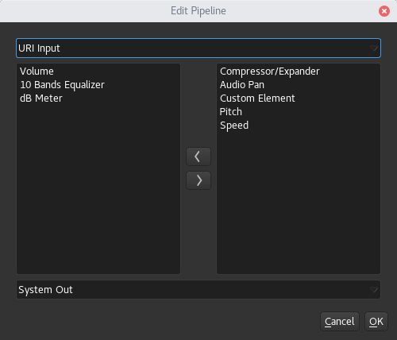

.. toctree::
    :hidden:

GStreamer Backend - Media Settings
==================================

Media Cues relay on a backend to provide playback capabilities. LiSP currently
have only a GStreamer backend.

A backend provide a "media object" to the cue, this object is composed by multiple
elements that can be added/removed and configured, every element process data and
feed the result to the next element. In GStreamer the set of active elements is
referred as "pipeline".

The elements and their settings can be changed in a specific tab in the cue settings:

|

.. image:: media/gst_media_settings.png
    :alt: Linux Show Player - GStreamer Backed settings
    :align: center

|

The active elements can be changed using the *Change Pipeline* button

|

The default elements can be changed via ``File > Preferences > GStreamer settings``

Input elements
--------------

Feed the pipeline with data

URI Input
^^^^^^^^^

Read and decode data from a URI (usually a URL), can be a local file or a remote one
(eg: `<http://docs.gstreamer.com/media/sintel_cropped_multilingual.webm>`_)

* **Source:** the URI to look for data (a "find file" button is provided for searching local files)
* **Buffering:** buffering options (for slower random access media such as a network file server)
    * **Use Buffering:** enable buffering
    * **Attempt download on network:** attempt to download the entire file on disk
    * **Buffer size:** buffer size in bytes, -1 will use the default value

Auto Src
^^^^^^^^

Get the audio from the system-default input device (eg: microphone), no option is provided

Preset Src
^^^^^^^^^^
Generate some tone using some wired functions. Just Fun :-)

*Don't try to use this in combination with the speed element or bad things will happen*

.. Note::
    To use ``Auto Src`` and ``Preset Src`` you need to create a media cue with
    some random file, then change the source element.

Plugins elements
----------------

Used for audio-processing or data-probing, in some case the order affect the results

Volume
^^^^^^

Allow to change the volume level, or mute the media.

* **Volume:** volume level in dB (can be muted)
* **Normalized Volume:** parameter used by other components (e.g. ReplayGain) to
  normalize the volume level without affecting user values, you can only reset the value (to 0dB).

10 Bands Equalizer
^^^^^^^^^^^^^^^^^^

Allow to equalize the media with 10 frequency bands [30Hz-15KHz].

dB Meter
^^^^^^^^

Allow external components to get the current sound level, used for UI visualization.

* **Time between levels:** millisecond between one extracted value and the next *lower values will use a more CPU*
* **Peak TTL:** Time To Live of decay peak before it falls back (in milliseconds)
* **Peak falloff:** Decay rate of decay peak after TTL (in dB/sec)

Speed
^^^^^

Speedup or slowdown the media, without affecting the pitch.

Pitch
^^^^^

Allow to change the media pitch by semitones.

Compressor/Expander
^^^^^^^^^^^^^^^^^^^

Provide `Dynamic range compression <https://en.wikipedia.org/wiki/Dynamic_range_compression>`_.

* **Type**
   * *Compressor*
   * *Expander*
* **Curve shape:** Selects how the ratio should be applied
   * *Hard Knee*
   * *Soft Knee*
* **Ratio:** Ratio that should be applied
* **Threshold:** minimum value from which the filter is activated (in dB)

Audio Pan
^^^^^^^^^

Allow to control stereo panorama (left <-> right).

.. Note::
    When used the audio will be forced to stereo

Custom Element
^^^^^^^^^^^^^^

Allow to manually create a custom GStreamer "elements" using the framework syntax,
some instruction and example can be found :doc:`here <gst_custom_elements>`.

Output elements
---------------

Push data to an output device

Auto sink
^^^^^^^^^

Use the system-default output device, no option is provided.

ALSA sink
^^^^^^^^^

Output to an ALSA device

* **ALSA device:** the output device to be used (parsed form asound configuration file)

PulseAudio sink
^^^^^^^^^^^^^^^

Output to the default pulseaudio output device, no option is provided.

Jack sink
^^^^^^^^^

Output to `Jack <http://www.jackaudio.org/>`_ server

An editable view of the current connections is shown, on the left the cue
outputs, on the right the available jack inputs.
Selecting one input an one output it's possible to connect/disconnect using the
provided button.

.. Note::
    * Unless the cue is created with ``Jack sink`` as output, by default all
      channels are disconnected
    * The connections to Jack are opened/closed when the cue start/stop
    * If no instance of a Jack-server is found a new one is started

.. Warning::
    This element can cause problems depending on the jack server configuration and/or
    status. Currently it's quite hard to debug those problems since the element
    is partially based on a GStreamer element that allow little control over
    the used client.