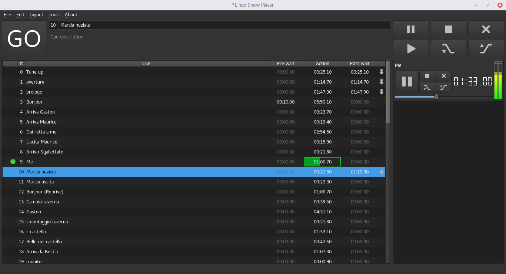

.. toctree::
    :hidden:

List Layout
===========

The List Layout, as the name suggest, organize the cues in a (single) list,
a sidebar to monitor and interact with the running cues is also provided.

User Interface
--------------

Top Panel
^^^^^^^^^

* **Top left:** we can find the ``GO`` button, this will execute the selected cue and go forward;
* **Top center:** name and description of the current cue are displayed here;
* **Top right:** list-control commands are provided, those allow to stop, pause,
  restart, interrupt and fade all the cues in the list.

Left List
^^^^^^^^^

All the cues are shown here in a list-like view, the following column are shown:

* **(status):** the first column show the current state of the cue running/paused/error and a selection indicator
* **#:** The cue index
* **Cue:** The cue name
* **Pre wait:** Pre wait indicator
* **Action:** Cue time indicator
* **Post wait:** Post wait indicator
* **(next action):** What should be done after "post wait"

Right (running) List
^^^^^^^^^^^^^^^^^^^^
The running cues are shown here, you can stop, pause/restart, interrupt and fade
single cues.

Layout Commands
---------------

Navigate the cues
^^^^^^^^^^^^^^^^^
To change the current cue, directional keys can be used to go up and down into the list,
alternatively ``Left-Clicking`` the cue will set it as current.

Cues Execution
^^^^^^^^^^^^^^
To execute the current cue, press ``Space``, (can be changed in the layout options)
or use the ``GO`` button.

Cues Editing
^^^^^^^^^^^^
The setting dialog for a cue can be opened in two ways: ``Right-Click > Edit cue``
or ``Double-Click`` the cue.

Cues can be selected/deselected with ``Right-Click > Select``, ``CTRL+Space`` or
``CTRL+Click``

Move and Copy Cues
^^^^^^^^^^^^^^^^^^
* **Move:** cues can be moved with a simple ``Drag&Drop``
* **Copy:** cues can be copied using ``CTRL+Drag&Drop``

Layout Options
--------------

In the application settings (``File > Preferences``) various options are provided:

* **Show playing cues:** show/hide the "Right List" and list control buttons
* **Show dB-Meters:** show/hide the db-meters for running media-cues
* **Show accurate time:** show/hide tens of seconds for running media-cues
* **Show seek-bars:** show/hide seek bars for running media-cues
* **Auto-select next cue:** if disabled the next cue will not be selected automatically
* **At list end:**
    * **Stop:** the selection doesn't change when the last cue is executed
    * **Restart:** the selection is moved back to the first cue
* **Go key:** define up to 4 key-combinations that can be used to execute the current cue,
  to do so, double click the edit-area, then enter your keys combinations
* **Use fades:** when disabled the corresponding buttons on the right-panel
  executes their action without fades.

|

.. image:: media/list_layout_settings.png
    :alt: Linux Show Player - List Layout settings
    :align: center