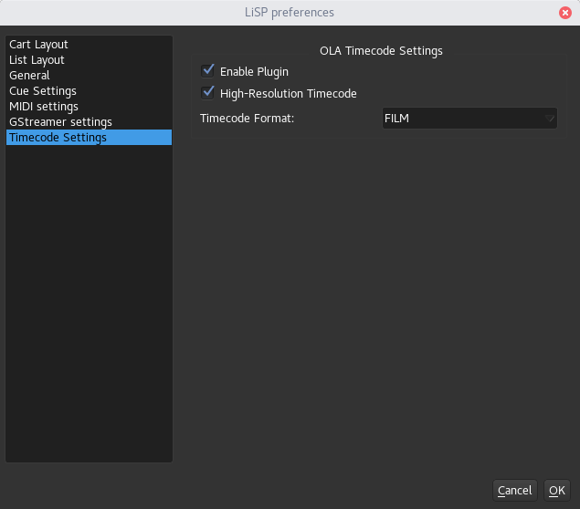
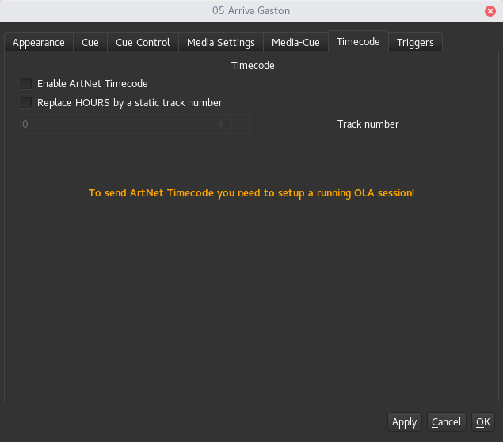

ArtNet Timecode
===============

This plugin can be used to send the timecode of your running audio files over
ArtNet to trigger cues inside a lighting control software or lighting desk which
support ArtNet Timecode such as "Chamsys MagicQ". This plugin works is meant as a
alternative to the Chamsys Winamp plugin, which doesnt work under Linux.
To get an general idea what is this all about, have a look `here <https://www.youtube.com/watch?v=Wu1iPkdzMJk>`_.

In order to work, this plugin needs `OLA <https://www.openlighting.org/ola/>`_
installed and a running OLA session on your computer.

How to use
----------

First make sure that OLA is up and running, `<http://localhost:9090>`_ gives you
the OLA interface.

Timecode Preferences
--------------------

|

To enable and setup the plugin go to ``File > Preferences > Timecode Settings``.

* **Enable Plugin:** enables/disable the plugin
* **High Resolution Timecode:** enables sending every single frame, to get more accurate timing
* **Timecode Format:** choose between ``SMPTE``, ``FILM`` and ``EBU``.
  The format has to match the timecode used by the software which receives it.

Timecode Cue Settings
---------------------

|

For media cues you can decide if it sends timecode or not. This can be set in the
``Cue-Settings > Timecode`` Tab.

* **Enable ArtNet Timecode:** enables sending timecode for this cue
* **Replace HOURS by a static track number:** if checked, the ``HOURS`` field in
  the timecode is replaced by a static number, which can be used to identify
  which track currently sends timecode to your lighting software.

.. Note::
    If you work with multiple cuelists on your lighting desk you than can choose
    the following setup as example:

    * cuelist 1 refers to track 1 and uses HOUR=1
    * cuelist 2 refers to track 2 and uses HOUR=2
    * ... and so on
