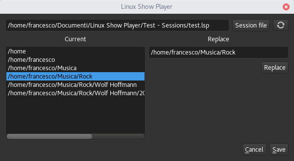

Session URI Editor
==================

This module provide a simple utility that allow to replace the media-files "paths"
stored into a session file, this allow to move a show to a different PC with media-files
located in different directories.

How to use
----------

In the menu ``Tools > Uri session change`` open the following window:

|

On the top, the ``Session file`` button allow to search for a file, on the right a
``reload`` button allow to reset all the changes.

On the left, a list of (split) directories is shown, those can be selected, and
edited, when the ``replace`` button is pressed the list is updated to reflect the changes.

The ``save`` button will allow to save the session file to a new location.
